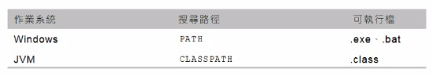

# Chapter 02 -- 從 JDK 到 IDE #

## 學習目標 ##

* 了解與設定 PATH
* 了解與指定 CLASSPATH、SOURCEPATH
* 使用 package 與 import 管理類別
* 初探模組平台系統
* 認識 JDK 與 IDE 的對應

## 小節 ##

* [2.1 從 "Hello, World" 開始](#21-從-hello-world-開始)
* [2.2 管理原始碼與位元碼檔案](#22-管理原始碼與位元碼檔案)
* [2.3 初探模組平台系統](#23-初探模組平台系統)
* [2.4 使用 IDE](#24-使用-ide)
* [2.5 重點複習](#25-重點複習)

## 2.1 從 "Hello, World" 開始 ##

### 2.1.1 撰寫 Java 原始碼 ###

* 注意事項
  * 主檔名與類別名稱必須相同
  * 字母大小寫

### 2.1.2 PATH 是什麼? ###

* 在安裝多個 JDK 或 JRE 的變腦中，必須知道執行了哪個版本的 JDK 或 JRE，確定 PATH 資訊是一定要做的動作。

### 2.1.3 JVM (java) 與 classpath ###

* JVM 的可執行檔副檔名是 .class。
* 啟動 JVM 的指令是 java；而要求 JVM 執行，只要指定類別名稱，不用附加 .class 副檔名。
* 想在 JVM 中執行某個 .class 檔，就要告訴 JVM 到哪些路徑下尋找檔案，方式是透過 classpath 指定其 .class 檔的路徑。
* Path 與 classpath 是不同層次的環境變數，實體作業系統搜尋可執行檔是看 path，JVM 搜尋可執行檔 (.class) 只看 classpath。
* 使用 -classpath 引數來告知 JVM 可執行檔的位置。所寫為 -cp。
* 如果在 JVM 的 classpath 路徑資訊中都找不到指定的類別檔案，就會出現 java.lang.NoClassDefFoundError 訊息。

    
    
path 與 classpath

### 2.1.4 編譯器 (javac) 與 classpath ###

## 2.2 管理原始碼與位元碼檔案 ##

### 2.2.1 編譯器 (javac) 與 sourcepath ###

* 首先需要解決原始碼與位元碼都放在一起的問題
* 使用 javac 編譯
  * javac -verbose -sourcepath src -cp classes -d classes src/Main.java
    * -verbose: 顯示編譯器編譯的過程
    * -sourcepath: 指定原始碼存放的位置。在 src 搜尋原始碼檔案。
    * -classpath: 指定已存在的位元碼位置。在 classes 搜尋位元碼檔案。以 -cp 簡稱。
    * -d: 指定編譯完成的位元碼存放位置

* 使用 java 執行
  * java -cp classes Main

### 2.2.2 使用 package 管理類別 ###

* 當類別原始碼開始使用 package 進行分類時，就會具有四種管理上的意義:
  * Source code 要放置在與 package 定義名稱階層相同的資料夾階層。
  * Package 定義名稱與 class 定義名稱，會結合而成類別的完全吻合名稱 (Fully qualified name)。
  * 位元碼檔案要放置在與 package 定義名稱階層相同的資料夾階層。
  * 要在套件間共用的類別或方法必須宣告為 public。

### 2.2.3 使用 import 偷懶 ###

* Import 是偷懶工具，不能偷懶就回歸最保守的寫法。

## 2.3 初探模組平台系統 ##

### 2.3.1 JVM (java) 與 module-path ###

* 模組平台系統與 Java 程式語言本身沒有關係。

### 2.3.2 編譯器 (javac) 與 module-path ###

### 2.3.3 編譯器 (javac) 與 module-source-path ###

## 2.4 使用 IDE ##

### 2.4.1 IDE 專案管理基礎 ###

### 2.4.2 使用了哪個 JRE ###

* java -version

### 2.4.3 類別檔案版本 ###

* javac -version

## 2.5 重點複習 ##

* 撰寫 Java 程式需注意
  * 副檔名是 .java
  * 主檔名與類別名稱必須相同
  * 注意每個字母大小寫
  * 空白只能是半名空白字元或是 Tab 字元。
* 一個 .java 檔可以定義數個類別，但是只能有一個公開 (public) 類別，而且檔案名稱必須與公開類別名稱相同。
* 規格書中規定 main() 方法的形式一定得是:
  * public static void main(String[] args)
* 使用 JDK 中的 javac 工具，將原始碼 (source code, java code) 編譯 (compile) 成位元碼 (byte code)，接著再將位元碼送入至虛擬作業系統 (JVM) 中執行。
  * javac -sourcepath src -classpath classes -d classes src/Main.java
    * 透過 -sourcepath 指定原始碼的路徑資訊
    * 透過 -classpath 指定可執行檔 (.class) 的路徑資訊，簡稱 -cp
    * 透過 -d 指定編譯完成後，位元碼的存放位置
